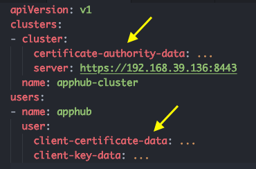

# 如何获取 Kubernetes 集群的访问信息

> 声明：“一键安装”仅执行一次性 API 调用， 不存储任何用户提交的 Token或证书内容。 此外，为了避免其他网络风险，请严格按照下述步骤填写下述参数。 

## kubeconfig 方式（仅供试用，权限较高）

在`一键安装`提示框内，选择 `Certificate` 方式。

> 说明：kubectl 默认会从 $HOME/.kube 目录下查找文件名为 config 的文件，但是也能通过设置环境变量 KUBECONFIG 或者通过设置去指定其它 kubeconfig 文件。kubeconfig 就是为访问集群所作的配置。

执行：

```
$ cat $HOME/.kube/config
```



其中的 `server`，`certificate-authority-data`，`client-certificate-data`，`client-key-data`，即分别对应 `server_url`, `ca_certificate`, `client_certificate`, `client_key` 四个参数。

## 快速方式（仅供试用，权限较高）

在`一键安装`提示框内，选择 `Token` 方式。

1. 查看所有集群

```
$ kubectl config get-contexts
CURRENT   NAME                   CLUSTER      AUTHINFO           NAMESPACE
*         kubernetes-admin-ack   kubernetes   kubernetes-admin
          minikube               minikube     minikube
```

2. 选择要管理的集群

```
$ kubectl config use-context kubernetes-admin-ack
```

3. 给默认 ServiceAccount 授权为 cluster-admin

```
$ kubectl create clusterrolebinding default-admin --clusterrole cluster-admin --serviceaccount=default:default
```

4. 获取 server_url（ APIServer 地址）

```
$ export CURRENT_CONTEXT=$(kubectl config current-context) && export CURRENT_CLUSTER=$(kubectl config view -o go-template="{{\$curr_context := \"$CURRENT_CONTEXT\" }}{{range .contexts}}{{if eq .name \$curr_context}}{{.context.cluster}}{{end}}{{end}}") && echo $(kubectl config view -o go-template="{{\$cluster_context := \"$CURRENT_CLUSTER\"}}{{range .clusters}}{{if eq .name \$cluster_context}}{{.cluster.server}}{{end}}{{end}}")
```

5. 获取 ca_certificate （证书）

```
$ echo $(kubectl get secret -o go-template='{{index .data "ca.crt" }}' $(kubectl get sa default -o go-template="{{range .secrets}}{{.name}}{{end}}"))
```

6. 获取 sa_token （Token）

```
$ echo $(kubectl get secret -o go-template='{{index .data "token" }}' $(kubectl get sa default -o go-template="{{range .secrets}}{{.name}}{{end}}"))
```

## 安全方式（推荐，权限可控）

在`一键安装`提示框内，选择 `Token` 方式。

1. 通过 RBAC 限制 AppHub 的权限（请按照具体需求对 rules 部分进行调整）：

apphub-role-sa-bind.yaml

```
kind: ClusterRole
apiVersion: rbac.authorization.k8s.io/v1
metadata:
  name: apphub-role
rules:
- apiGroups: ["", "batch", "extensions", "apps"]
  resources: ["*"]
  verbs: ["*"]
---
apiVersion: v1
kind: ServiceAccount
metadata:
  name: apphub-user
  namespace: default
---
apiVersion: rbac.authorization.k8s.io/v1beta1
kind: ClusterRoleBinding
metadata:
  name: apphub-user
roleRef:
  apiGroup: rbac.authorization.k8s.io
  kind: ClusterRole
  name: apphub-role
subjects:
- kind: ServiceAccount
  name: apphub-user
  namespace: default
```

1. 查看所有集群

```
$ kubectl config get-contexts
CURRENT   NAME                   CLUSTER      AUTHINFO           NAMESPACE
*         kubernetes-admin-ack   kubernetes   kubernetes-admin
          minikube               minikube     minikube
```

2. 选择要管理的集群

```
$ kubectl config use-context kubernetes-admin-ack
```

3. 提交 RBAC 规则

```
$ kubectl apply -f apphub-role-sa-bind.yaml
```

4. 获取 server_url（ APIServer 地址）

```
$ export CURRENT_CONTEXT=$(kubectl config current-context) && export CURRENT_CLUSTER=$(kubectl config view -o go-template="{{\$curr_context := \"$CURRENT_CONTEXT\" }}{{range .contexts}}{{if eq .name \$curr_context}}{{.context.cluster}}{{end}}{{end}}") && echo $(kubectl config view -o go-template="{{\$cluster_context := \"$CURRENT_CLUSTER\"}}{{range .clusters}}{{if eq .name \$cluster_context}}{{.cluster.server}}{{end}}{{end}}")
```

5. 获取 ca_certificate （证书）

```
$ echo $(kubectl get secret -n default -o go-template='{{index .data "ca.crt" }}' $(kubectl get sa apphub-user -n default -o go-template="{{range .secrets}}{{.name}}{{end}}"))
```

6. 获取 sa_token （Token）

```
$ echo $(kubectl get secret -n default -o go-template='{{index .data "token" }}' $(kubectl get sa apphub-user -n default -o go-template="{{range .secrets}}{{.name}}{{end}}"))
```

对此文档有疑问，请联系：hongchao.deng@alibaba-inc.com, jicheng.sk@alibaba-inc.com


